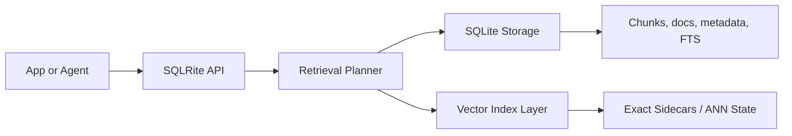

# SQLRite Project Guide

This document is the detailed project-level guide for SQLRite.

Use `/Users/jameskaranja/Developer/projects/SQLRight/README.md` as the product front door.
Use this file when you want the broader project picture: architecture, components, performance model, interfaces, packaging, and repository layout.

## Project Summary

SQLRite is an embedded retrieval engine built in Rust on top of SQLite.

It is designed for AI-agent memory, local RAG, and application-owned retrieval workloads where the default deployment should be a local database file and an in-process API, not a separate service cluster.

## Product Positioning

### Primary use case

The primary SQLRite use case is embedded retrieval:

- local application memory
- agent memory stores
- desktop and edge apps
- single-tenant or tenant-filtered local retrieval
- developer-owned RAG pipelines

### Secondary use cases

SQLRite also supports service boundaries when needed:

- HTTP query services
- compact HTTP for agent and benchmark clients
- gRPC for typed service calls
- MCP for tool-oriented agent runtimes

### What SQLRite is trying to optimize for

| Goal | Why it matters |
|---|---|
| embedded-first deployment | simpler ops, lower latency, easier distribution |
| SQL-native retrieval | less application glue code |
| deterministic retrieval behavior | easier debugging and evaluation |
| one-file persistence | straightforward local development and shipping |
| optional service surfaces | support multi-process or remote clients without changing the engine |

## Core Capabilities

### Retrieval

- text retrieval using SQLite FTS5
- vector retrieval using `brute_force`, `lsh_ann`, and `hnsw_baseline`
- weighted hybrid fusion
- reciprocal-rank fusion (RRF)
- deterministic tie-breaking
- tenant and metadata filtering
- document-scoped retrieval
- query-profile tuning for latency, balanced, or recall-oriented behavior

### SQL surface

- vector operators: `<->`, `<=>`, `<#>`
- helper functions such as `vector(...)`, `embed(...)`, `bm25_score(...)`, and `hybrid_score(...)`
- retrieval-aware DDL
- `SEARCH(...)` for concise SQL-native retrieval
- `EXPLAIN RETRIEVAL` for query planning visibility

### Operations

- health checks and doctor output
- file backups and verification
- snapshots and PITR restore flows
- compaction
- benchmark and evaluation tooling

### Security

- RBAC policy files
- tenant key registry management
- encrypted metadata workflows
- audit export
- secure server defaults for HTTP deployments

### Migration

- SQLite and libSQL imports
- pgvector JSONL imports
- Qdrant, Weaviate, and Milvus export imports

## Current Performance Position

SQLRite is strongest in embedded mode.

Current documented benchmark snapshot on a deterministic filtered cosine workload (`5k` records, `120` measured queries, `64` dimensions, `8` tenants, `top_k=10`):

| Mode | QPS | p95 latency | Recall@10 |
|---|---:|---:|---:|
| `brute_force` embedded | `3380.07` | `0.3543 ms` | `1.0` |
| `hnsw_baseline` embedded | `3530.96` | `0.3327 ms` | `1.0` |
| `brute_force` HTTP compact | `1807.27` | `0.7538 ms` | `1.0` |
| `hnsw_baseline` HTTP compact | `1828.17` | `0.7070 ms` | `1.0` |

Practical conclusion:

- embedded mode is the product’s strongest deployment path
- compact HTTP narrows the transport gap materially
- if raw local performance is the main goal, embed SQLRite directly

## High-Level Architecture



### Storage plane

SQLite holds:

- chunk rows
- document rows
- metadata
- FTS indexes
- schema state
- backup and maintenance-compatible persistence

### Retrieval plane

The retrieval layer handles:

- exact vector search
- ANN search
- lexical candidate generation
- hybrid planning
- score fusion
- payload materialization

### Service plane

Optional service surfaces sit on top of the same engine:

- CLI
- HTTP
- compact HTTP
- gRPC
- MCP

## Main Components

| Path | Responsibility |
|---|---|
| `/Users/jameskaranja/Developer/projects/SQLRight/src/lib.rs` | core engine, planner, storage integration |
| `/Users/jameskaranja/Developer/projects/SQLRight/src/vector_index.rs` | exact and ANN vector index implementations |
| `/Users/jameskaranja/Developer/projects/SQLRight/src/main.rs` | main CLI |
| `/Users/jameskaranja/Developer/projects/SQLRight/src/server.rs` | HTTP server |
| `/Users/jameskaranja/Developer/projects/SQLRight/src/grpc.rs` | gRPC service |
| `/Users/jameskaranja/Developer/projects/SQLRight/src/security.rs` | security and tenant-key logic |
| `/Users/jameskaranja/Developer/projects/SQLRight/src/ingest.rs` | ingestion worker paths |
| `/Users/jameskaranja/Developer/projects/SQLRight/src/migrate.rs` | migration tooling |
| `/Users/jameskaranja/Developer/projects/SQLRight/src/ops.rs` | backup, restore, and maintenance workflows |
| `/Users/jameskaranja/Developer/projects/SQLRight/crates/sqlrite-sdk-core` | shared SDK envelope types |

## Interfaces

### CLI

Main command families:

- `sqlrite init`
- `sqlrite query`
- `sqlrite sql`
- `sqlrite ingest`
- `sqlrite migrate`
- `sqlrite serve`
- `sqlrite grpc`
- `sqlrite mcp`
- `sqlrite backup`
- `sqlrite compact`
- `sqlrite benchmark`
- `sqlrite doctor`

### Companion binaries

Typical companion binaries installed from source:

- `sqlrite-security`
- `sqlrite-reindex`
- `sqlrite-ingest`
- `sqlrite-serve`
- `sqlrite-grpc-client`
- `sqlrite-mcp`
- `sqlrite-bench-suite`
- `sqlrite-eval`

### HTTP

Important endpoints:

- `GET /healthz`
- `GET /readyz`
- `GET /metrics`
- `POST /v1/query`
- `POST /v1/query-compact`
- `POST /v1/sql`
- `POST /v1/rerank-hook`

### gRPC

Use gRPC when you want typed query and SQL calls across a service boundary.

### MCP

Use MCP when SQLRite should present as a callable tool inside an agent runtime.

## Embedded Development Workflow

Typical embedded workflow:

1. create or open a database
2. ingest chunks and metadata
3. query with text, vector, or hybrid retrieval
4. tune vector storage and query profile if needed
5. use backup and compaction as the dataset matures

Minimal start:

```bash
sqlrite init --db app_memory.db --seed-demo
sqlrite query --db app_memory.db --text "local memory" --top-k 3
```

## Project Documentation Map

| Topic | Primary document |
|---|---|
| public front page | `/Users/jameskaranja/Developer/projects/SQLRight/README.md` |
| docs home | `/Users/jameskaranja/Developer/projects/SQLRight/docs/README.md` |
| getting started | `/Users/jameskaranja/Developer/projects/SQLRight/docs/getting-started.md` |
| embedded usage | `/Users/jameskaranja/Developer/projects/SQLRight/docs/embedded.md` |
| querying | `/Users/jameskaranja/Developer/projects/SQLRight/docs/querying.md` |
| SQL retrieval | `/Users/jameskaranja/Developer/projects/SQLRight/docs/sql.md` |
| ingestion | `/Users/jameskaranja/Developer/projects/SQLRight/docs/ingestion.md` |
| server and API | `/Users/jameskaranja/Developer/projects/SQLRight/docs/server-api.md` |
| security | `/Users/jameskaranja/Developer/projects/SQLRight/docs/security.md` |
| migrations | `/Users/jameskaranja/Developer/projects/SQLRight/docs/migrations.md` |
| operations | `/Users/jameskaranja/Developer/projects/SQLRight/docs/operations.md` |
| performance | `/Users/jameskaranja/Developer/projects/SQLRight/docs/performance.md` |
| examples | `/Users/jameskaranja/Developer/projects/SQLRight/docs/examples.md` |
| distribution | `/Users/jameskaranja/Developer/projects/SQLRight/docs/distribution.md` |
| release policy | `/Users/jameskaranja/Developer/projects/SQLRight/docs/release_policy.md` |

## Repository Layout

| Path | Purpose |
|---|---|
| `/Users/jameskaranja/Developer/projects/SQLRight/src` | engine, planner, storage, CLI, server code |
| `/Users/jameskaranja/Developer/projects/SQLRight/src/bin` | companion binaries |
| `/Users/jameskaranja/Developer/projects/SQLRight/examples` | runnable examples |
| `/Users/jameskaranja/Developer/projects/SQLRight/sdk/python` | Python SDK |
| `/Users/jameskaranja/Developer/projects/SQLRight/sdk/typescript` | TypeScript SDK |
| `/Users/jameskaranja/Developer/projects/SQLRight/docs` | current public docs |
| `/Users/jameskaranja/Developer/projects/SQLRight/deploy` | Docker and deployment assets |
| `/Users/jameskaranja/Developer/projects/SQLRight/benchmarks` | benchmark profiles and benchmark helper assets |

## Packaging and Distribution

Current supported paths:

- Cargo source install
- GitHub release archive
- Docker image
- seeded Docker Compose demo
- optional Linux packaging via `nfpm`

Important current detail:

- the source-install path is the best way to get the full SQLRite toolchain
- the release installer path currently installs `sqlrite`

## Examples Worth Running

| Example | Command |
|---|---|
| minimal embedded search | `cargo run --example basic_search` |
| retrieval pattern overview | `cargo run --example query_use_cases` |
| checkpointed ingestion | `cargo run --example ingestion_worker` |
| secure tenant flow | `cargo run --example secure_tenant` |
| rotation fixture | `cargo run --example security_rotation_workflow` |
| tool adapter | `cargo run --example tool_adapter` |

## Publishing Readiness Notes

The public surface is organized around:

- one current root README
- one current `docs/` tree
- product-facing examples
- embedded-first positioning throughout the docs
