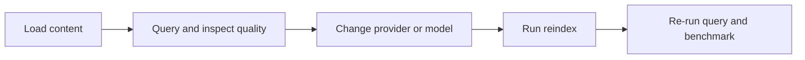

# Ingestion and Reindexing Guide

This guide covers the two main ways to load content into SQLRite and the supported ways to regenerate embeddings later.

## Ingestion Paths

| Path | Best for | Command |
|---|---|---|
| Direct ingest | small numbers of chunks, scripting, demos | `sqlrite ingest` |
| Worker ingest | checkpointed batch or file ingestion | `sqlrite-ingest` |

## Before You Start

Create a working database:

```bash
sqlrite init --db sqlrite_ingest.db --seed-demo
```

## 1. Direct Single-Chunk Ingest

Use direct ingest when you already know the chunk ID, document ID, content, and embedding.

```bash
sqlrite ingest \
  --db sqlrite_ingest.db \
  --id chunk-100 \
  --doc-id doc-100 \
  --content "SQLRite keeps retrieval local and easy to reason about." \
  --embedding 0.9,0.1,0.0
```

What this does:

- inserts one chunk immediately
- makes it available for subsequent queries

Validate the insert:

```bash
sqlrite query --db sqlrite_ingest.db --text "retrieval local" --top-k 3
```

## 2. Worker-Based Ingestion

Use the worker when you want resumable ingestion with checkpoints and chunking.

```bash
sqlrite-ingest \
  --db sqlrite_ingest.db \
  --job-id docs-import \
  --doc-id guide-1 \
  --file ./README.md \
  --checkpoint ingest.checkpoint.json \
  --batch-size 64 \
  --json
```

What the worker adds:

| Capability | Why it matters |
|---|---|
| checkpoints | restart-safe ingestion |
| batching | better throughput |
| deterministic chunk IDs | repeatable imports |
| chunking strategies | safer ingestion of long files |
| model version tracking | clearer reindex history |

## 3. Decide When to Reindex

Reindex when any of these change:

- embedding provider
- embedding model
- embedding model version
- embedding dimensionality assumptions
- target storage or retrieval profile you want to standardize on

## Reindex Providers

| Provider | Use when | Requirements |
|---|---|---|
| `deterministic` | local development and reproducible tests | none |
| `openai` | OpenAI-compatible embeddings | endpoint and API key |
| `custom` | your own embedding service | matching HTTP API |

## 4. Deterministic Reindex

This is the easiest and most reproducible reindex flow.

```bash
sqlrite-reindex \
  --db sqlrite_ingest.db \
  --provider deterministic \
  --target-model-version local-v2 \
  --batch-size 64
```

Use this when you want:

- reproducible examples
- CI-safe behavior
- local experimentation without a network dependency

## 5. OpenAI-Compatible Reindex

Requirements:

- a reachable OpenAI-compatible embeddings endpoint
- `OPENAI_API_KEY` in the environment

```bash
sqlrite-reindex \
  --db sqlrite_ingest.db \
  --provider openai \
  --endpoint https://api.openai.com/v1/embeddings \
  --model text-embedding-3-small \
  --api-key-env OPENAI_API_KEY \
  --target-model-version openai-v1 \
  --batch-size 32
```

## 6. Custom HTTP Reindex

Use this when your organization already runs an internal embedding service.

```bash
sqlrite-reindex \
  --db sqlrite_ingest.db \
  --provider custom \
  --endpoint http://localhost:8080/embed \
  --input-field inputs \
  --embeddings-field embeddings \
  --target-model-version internal-v1
```

## Recommended Workflow



## Validate After Ingest or Reindex

Run these checks:

```bash
sqlrite doctor --db sqlrite_ingest.db --json
sqlrite query --db sqlrite_ingest.db --text "retrieval local" --top-k 5
```

What to look for:

| Check | Healthy sign |
|---|---|
| `doctor` | integrity is healthy and chunk count is non-zero |
| `query` | returns expected content from the newly ingested corpus |

## Deeper References

- `project_docs/runbooks/agent_integrations_reference.md`
- `project_docs/runtime_config_profiles.md`
- `project_docs/runbooks/query_profile_hints.md`
