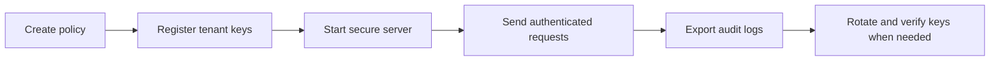

# Security and Multi-Tenant Guide

This guide explains the security workflows shipped with SQLRite.

It focuses on the operational pieces a developer or platform team actually needs: RBAC policy, tenant keys, metadata encryption, audit export, and secure server mode.

## Security Capabilities

| Capability | Tool |
|---|---|
| RBAC policy generation | `sqlrite-security init-policy` |
| tenant key management | `sqlrite-security add-key` |
| encrypted metadata rotation | `sqlrite-security rotate-key` |
| key verification | `sqlrite-security verify-key` |
| audit export | `sqlrite-security export-audit` |
| secure server defaults | `sqlrite serve --secure-defaults` |

## 1. Generate a Starter RBAC Policy

```bash
sqlrite-security init-policy --path .sqlrite/rbac-policy.json
```

Expected result:

- a starter policy file is written at `.sqlrite/rbac-policy.json`

## 2. Register Tenant Keys

Add the first active key:

```bash
sqlrite-security add-key \
  --registry .sqlrite/tenant_keys.json \
  --tenant demo \
  --key-id k1 \
  --key-material demo-secret-material \
  --active
```

Before rotating, add the next key:

```bash
sqlrite-security add-key \
  --registry .sqlrite/tenant_keys.json \
  --tenant demo \
  --key-id k2 \
  --key-material demo-secret-material-v2 \
  --active
```

What this gives you:

| File | Purpose |
|---|---|
| `.sqlrite/rbac-policy.json` | authorization policy |
| `.sqlrite/tenant_keys.json` | tenant key registry |

## 3. Rotate Encrypted Metadata

```bash
sqlrite-security rotate-key \
  --db sqlrite_demo.db \
  --registry .sqlrite/tenant_keys.json \
  --tenant demo \
  --field secret_payload \
  --new-key-id k2 \
  --json
```

Important note:

- on the seeded demo database, `rotated_chunks` is typically `0` unless encrypted `secret_payload` values already exist
- use `examples/security_rotation_workflow.rs` when you want a reproducible rotation fixture

## 4. Verify Key Coverage

```bash
sqlrite-security verify-key \
  --db sqlrite_demo.db \
  --registry .sqlrite/tenant_keys.json \
  --tenant demo \
  --field secret_payload \
  --key-id k2
```

Use this after a rotation to confirm the target key can read the encrypted field.

## 5. Export Audit Logs

```bash
sqlrite-security export-audit \
  --input .sqlrite/audit/server_audit.jsonl \
  --output audit_export.jsonl \
  --format jsonl \
  --tenant demo
```

Use this when you want tenant-scoped audit review or downstream retention workflows.

## 6. Run the Server with Secure Defaults

```bash
sqlrite serve \
  --db sqlrite_demo.db \
  --bind 127.0.0.1:8099 \
  --secure-defaults \
  --authz-policy .sqlrite/rbac-policy.json \
  --audit-log .sqlrite/audit/server_audit.jsonl \
  --control-token dev-token
```

In secure mode, query and SQL requests require these headers:

| Header | Purpose |
|---|---|
| `x-sqlrite-actor-id` | authenticated caller identity |
| `x-sqlrite-tenant-id` | tenant boundary |
| `x-sqlrite-roles` | role assignment |

Authenticated query example:

```bash
curl -fsS -X POST \
  -H "content-type: application/json" \
  -H "x-sqlrite-actor-id: reader-1" \
  -H "x-sqlrite-tenant-id: demo" \
  -H "x-sqlrite-roles: reader" \
  -d '{"query_text":"agent memory","top_k":3}' \
  http://127.0.0.1:8099/v1/query
```

What happens without auth context:

- `GET /healthz` still works
- protected query and SQL endpoints return `403`

## Recommended Secure Workflow



## Deeper References

- `project_docs/security/threat_model.md`
- `project_docs/security/compliance_posture.md`
- `project_docs/runbooks/security_rbac_defaults.md`
- `project_docs/runbooks/audit_export_key_rotation.md`
- `example_docs/core_examples/secure_tenant.md`
- `example_docs/core_examples/security_rotation_workflow.md`
